# 🎧 Spotify Delta Lake — Event-Driven Lakehouse (Databricks + AWS)

> A personal data engineering project simulating an **event-driven Delta Lakehouse architecture** built with **Databricks**, **AWS**, and the **Spotify Web API**.  
> Every time new Spotify data lands in the S3 bucket, a **Lambda function triggers** a Databricks **pipeline** that flattens, cleans, and enriches the data up to the **Silver Layer**.  
> The next step will be building a **Gold Layer** and an interactive **Streamlit dashboard** for personal music insights.

---

## 🚀 Project Goals

- Simulate a **real-world, event-driven architecture** using serverless components.
- Implement **incremental & idempotent pipelines** using Delta Lake **MERGE** operations.
- Build a **dimensional model** from unique Spotify IDs (artists, albums, tracks).
- Lay the foundation for a **Gold Layer** and **Streamlit** analytics app.

---

## 🧩 Architecture Overview

```mermaid
%% Compact horizontal flowchart
flowchart LR
  A[Spotify API] -->|Pull recently played| B[Lambda: get_user_recent_played_spotify_data]
  B -->|Write JSON| C[(S3: my-raw-spotify-data/user_recent_played/)]
  C -->|New file detected| D[Lambda: Databricks Trigger]
  D -->|Call Jobs API| E[Databricks Bronze→Silver Pipeline]
  E -->|Merge by timestamp| F[Silver.user_recent_played]
  F -->|Extract unique IDs| G[Parallel Tasks: Artists • Albums • Tracks]
  G -->|Fetch new metadata| H[(Bronze Dimensional Tables)]
  H -->|Autoloader| I[Silver Dimensional Tables]
  I --> J[(Future: Gold Layer + Streamlit Dashboard)]

```

# ⚙️ Components Breakdown

## 1. **Lambda — `get_user_recent_played_spotify_data`**
📂 **Path:** `/get_user_recent_played_spotify_data/`

Simulates an **event producer** calling the **Spotify API** endpoint for recently played tracks.

📤 **Output:**  
Writes raw **JSON files** to:

s3://my-raw-spotify-data/user_recent_played/

🕒 **Trigger:**  
In this prototype, ingestion is simulated through a **manual pull** or a **scheduled Lambda trigger**.

---

## 2. **Lambda — Databricks Trigger**

Monitors the **S3 bucket** for new objects.  
When a new file arrives, it **invokes the Databricks Jobs API** to start the **main ETL pipeline**.

🔄 This approach mimics a **real event-driven workflow** using **serverless compute**.

---

## 3. **Databricks Pipeline — Bronze → Silver**

### 🟤 Bronze Layer  
- Stores **raw Spotify API responses** as JSON.  
- Schema is **semi-structured** and may vary between calls.

### ⚪ Silver Layer  
- **Flattens nested JSONs** and converts them into a **structured, queryable table**:  

silver.user_recent_played

- Uses **MERGE ON timestamp** to ensure:  
✅ Only **new records** are appended  
🚫 **Duplicates** are skipped  
⚡ **Incremental and idempotent** writes

🧩 The merge logic guarantees **data quality** without needing `dropDuplicates()` downstream.

---

## 4. **Databricks Pipeline — `[BRONZE/SILVER]_Dimensional_Data`**

⚙️ **Trigger:** Runs automatically at the end of the main pipeline.  
📦 **Core Functions:**
- Extracts unique IDs (`artist_id`, `album_id`, `track_id`) from `silver.user_recent_played`.  
- Compares them with existing **dimensional tables** (if any).  
- Pulls new **metadata from the Spotify API** for unseen IDs.  

📊 **Outputs:**
- Writes data into:  
- `bronze.artists`, `bronze.albums`, `bronze.tracks`  
- Uses **Autoloader** to transform and load curated data into:  
- `silver.artists`, `silver.albums`, `silver.tracks`

⚙️ Each category runs as a **parallel task**, simulating a **distributed, event-driven process**.

---

## 🧠 Design Principles

- **Event-driven simulation** → each new S3 object triggers an ETL job.  
- **Incremental & idempotent processing** → Delta Lake `MERGE` ensures consistency.  
- **Layered architecture** → Bronze → Silver → *(future)* Gold.  
- **Serverless orchestration** → AWS Lambdas + Databricks Jobs API.  
- **Scalable design** → easily extendable to Airflow, Step Functions, or EventBridge.  
- **Data lineage** → from raw Spotify JSON to curated dimensional datasets.

---

## 🧰 Tech Stack

| **Component** | **Technology** | **Cloud** |
|----------------|----------------|------------|
| **Storage** | S3 (`my-raw-spotify-data`) | AWS |
| **Compute** | Databricks (Community Edition) | AWS |
| **Orchestration** | AWS Lambda + Databricks Jobs API | AWS |
| **Transformations** | PySpark + Delta Lake + Autoloader | — |
| **API Source** | Spotify Web API | — |
| **Future BI** | Streamlit | — |

---

## 📁 Repository Structure

spotify-delta-lake/
│
├── get_user_recent_played_spotify_data/
│   └── lambda_function.py          # Pulls Spotify recently played data
│
├── databricks_notebooks/
│   ├── bronze_to_silver_user_recent_played.ipynb
│   ├── silver_dimensional_data.ipynb
│   └── utils/                      # Helper functions for flattening, merge, etc.
│
├── configs/
│   └── aws_env_variables.json
│
├── README.md                       # ← You are here
└── requirements.txt

---

## 🧪 Current Status

✅ **Implemented**
- Raw → Silver ingestion pipeline  
- Incremental `MERGE` logic  
- Dimensional data enrichment *(Artists, Albums, Tracks)*  
- Event-driven orchestration via AWS Lambda simulation

🚧 **In Progress**
- Gold Layer modeling  
- Streamlit interactive dashboard  
- CI/CD setup *(GitHub Actions, Terraform, etc.)*

---

## 📊 Future Vision — Gold Layer & Dashboard

🎯 Next step: build a **Gold Layer** combining fact and dimensional tables to enable analytics such as:
- 🎵 **Most played artists and genres**  
- ⏱️ **Listening time per week or month**  
- 📈 **Audio feature distributions** *(danceability, energy, valence, etc.)*

💻 This layer will feed a **Streamlit dashboard**, potentially **containerized with Docker** for deployment.

---

## 💡 Why This Project Matters

This project demonstrates how **modern data engineering principles** can be applied even to **personal datasets**.  
It showcases the ability to **design, automate, and orchestrate** an **end-to-end data lakehouse pipeline** using:
- **Real APIs**
- **Serverless compute**
- **Delta Lake best practices**

---

## 👤 Author

**Gabriele**  
💼 *Freelance Data Engineer & Entrepreneur*  
📍 *Building Data Products, Pipelines & Dashboards*  
🔗 [LinkedIn] • [Portfolio] • [Spotify Developer Docs]

---

> 💭 *Would you like me to add a “Quick Start / Setup” section (env vars, AWS setup, local simulation)?*  
That would make it perfect for recruiters or collaborators who want to **clone and run** your project.

